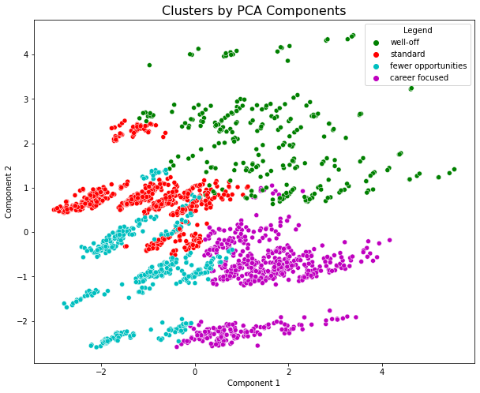
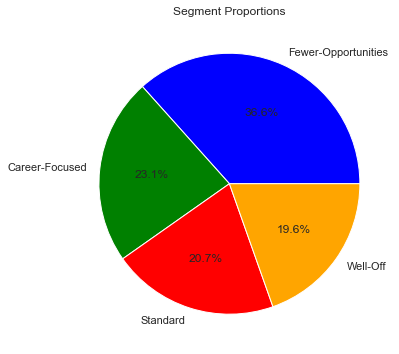
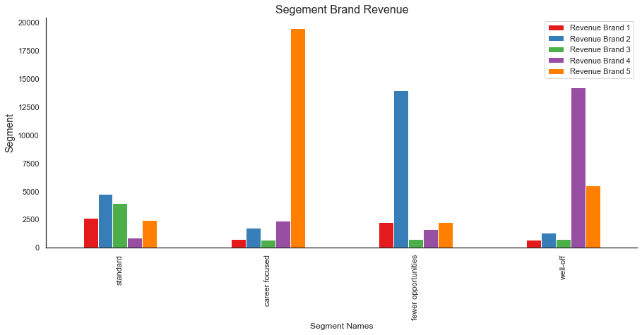
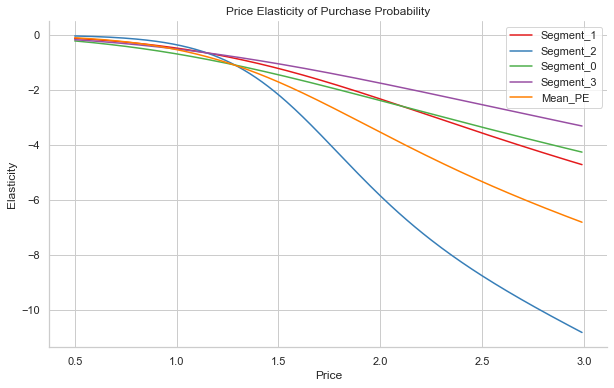
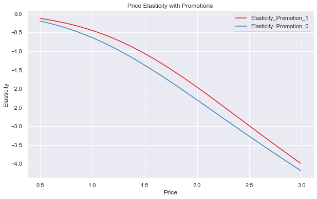

# Customers-Analytics-with-Python
Customer Segmentation and Purchase Analysis
## Description

## Customer Segmentation with PCA

## Segment Proportion

## Segment Brand Revenue

## Price Elasticity and Purchase Probabilities

## Price Elasticity with Promotion

